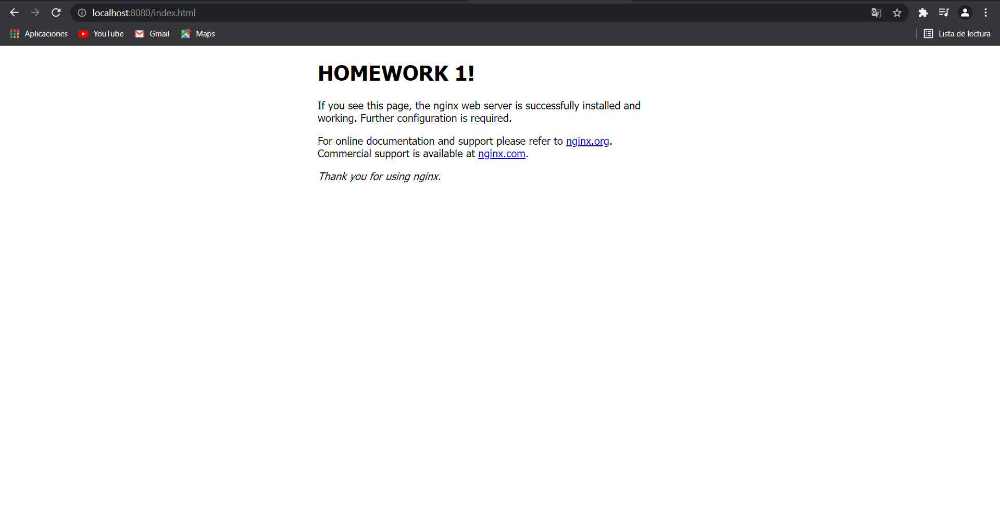
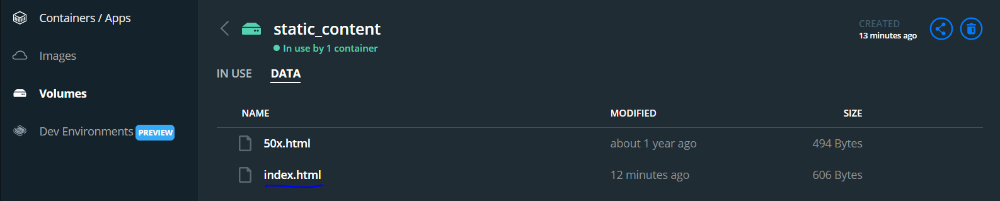

# NGINX Container

# nginx Container

Se ejecutaron los siguientes comando en la terminal:

## Crear Volumen:

```bash
docker volume create static_content
```

## Ejecutar Container:

```bash
docker run -dp 8080:80 --name exercise3 -v static_content:/usr/share/nginx/html nginx:1.19.3
```

## Cambiar contenido del fichero index.html

### Ingresar a la terminal del contenedor

```bash
docker exec -it exercise3 sh
```

### Ingresar a la carpeta que contiene el fichero

```console
# cd /usr/share/nginx/html
```

### Actualizar paquetes e instalar vim

```console
# apt-get update
# apt-get install vim
```

### Cambiar archivo html (Solo se cambió el contenido del titulo)

```console
# vim index.html
```

```html
<h1>HOMEWORK 1!</h1>
```

## Resultados

HTML

Volumen

